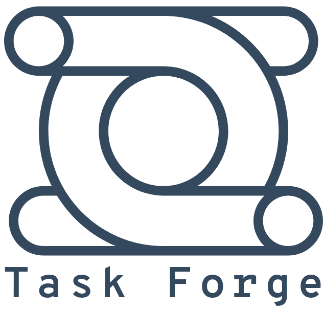

 

  

  <h3 align="center">A task/project management CLI tool</h3>
  
  

      <a href="#">Explore the Docs</a>
      ·
      <a href="https://github.com/Gander7/task-forge/issues">Report Bug</a>
      ·
      <a href="https://github.com/Gander7/task-forge/issues">Request Feature</a>

  

## About

Project is in an infantile state, you may see todos within the project but
I will be using Task Forge for it's own todos once it's in a stable enough state. :)

## Getting Started

### Prerequisites

- Node/NPM

### Installation

There are no official releases at this point, but if you want to play around:

1. Clone repos
2. Navigate to `bin` folder or add to your path
3. run the `t` command

## Usage

### Simple

#### Add Task

`t a this is a test task` or `t add this is a test task`

#### List Task

`t`

#### Remove Task

When deleting, there is no one letter command option to prevent accidental deletions.
`t del ID` or `t delete ID`

### Documentation

// TODO: Documentation, once it surpasses simple usage

## Roadmap

- Basic Task Crud + Done
- Start/Stop timers
- Task Projects, List projects, filter by projects
- Priority+Backlog, inspired from [Scrum]
- Add [Shields](https://shields.io/) as we go
- Integration (Push/Pull) [from github issues](https://help.github.com/en/github/managing-your-work-on-github/about-issues)
- Urgency, inspired from [Task Warrior](https://github.com/GothenburgBitFactory/taskwarrior)

## Contributing

Contributing is greatly appreciated.
Please see `CONTRIBUTING` for more information.

## License

Distributed under the MIT License. See `LICENSE` for more information.

## Acknowledgements/Inspiration

- Readme inspired by [Best-README-Template](https://github.com/othneildrew/Best-README-Template/blob/master/README.md)
- Commands inspired by [Task Warrior](https://github.com/GothenburgBitFactory/taskwarrior)
